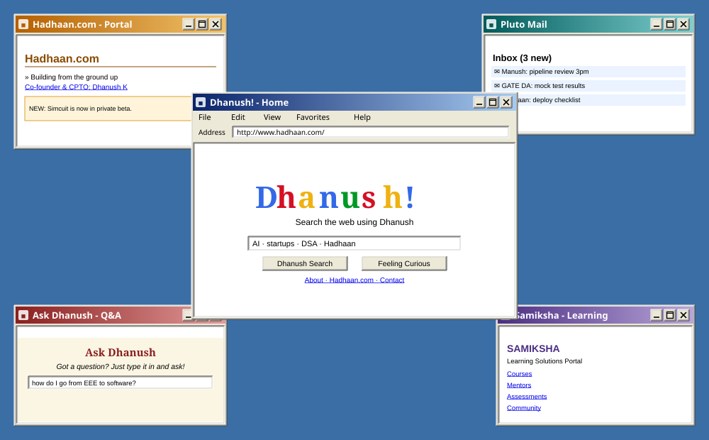
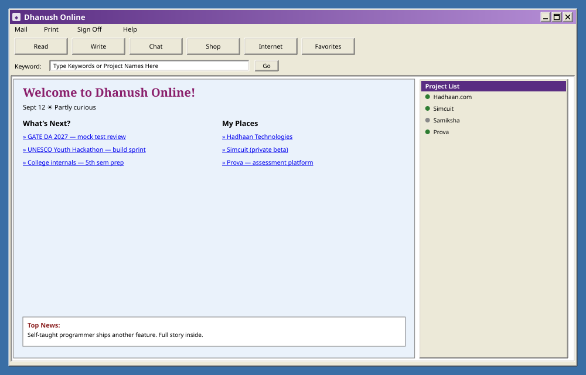
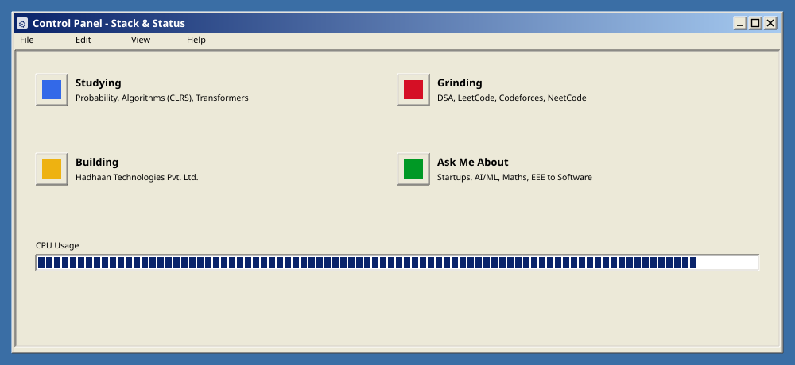
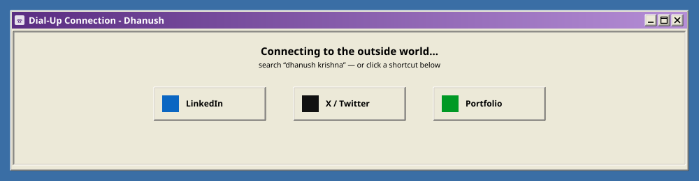

 

 

 

## ⬛ SYSTEM BENCHMARKS ⬛

 

## ⬛ COMPATIBLE COMPONENTS ⬛

**AI / ML / DATA SCIENCE** 
   

**CORE / SYSTEMS** 
  

**WEB / MOBILE** 
       

**DATA / INFRA** 
   

**PERIPHERALS** 
   

 

 

